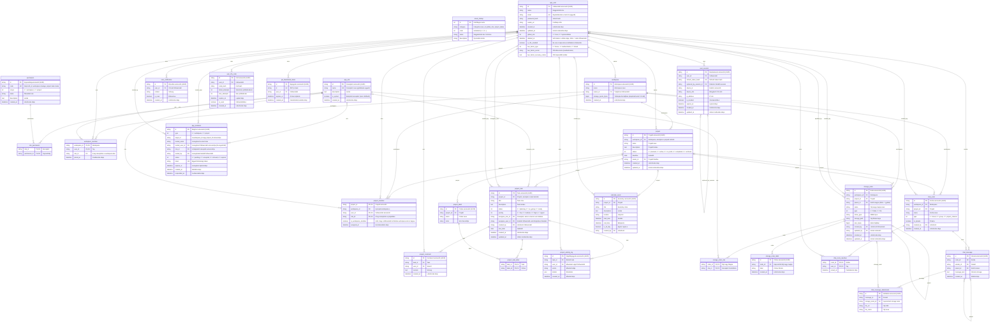

```mermaid

erDiagram

    %% ===== 0. ENUM / LOOKUP SZÓTÁR =====

    enum_lookup {
        int id PK "Elsődleges kulcs"
        string category "Kategória neve, pl. global_role, project_status"
        int code "Számkód (1, 2, 3...)"
        string name "Megjelenített név / kód név"
        string description "Opcionális leírás"
    }

    %% ===== 1. FELHASZNÁLÓ ÉS WORKSPACE =====

    app_user {
        string id PK "Felhasználó azonosító (UUID)"
        string name "Megjelenített név"
        string email UK "Bejelentkezési e-mail cím (egyedi)"
        string password_hash "Jelszó hash"
        string avatar_url "Profilkép URL"
        datetime created_at "Létrehozás ideje"
        datetime updated_at "Utolsó módosítás ideje"
        int global_role "1 = User, 2 = SystemAdmin"
        datetime deleted_at "Soft delete: a törlés ideje, NULL = aktív felhasználó"
        boolean is_2fa_enabled "Be van-e kapcsolva a kétfaktoros hitelesítés"
        int two_factor_type "0 = None, 1 = Authenticator, 2 = Email"
        string two_factor_secret "2FA titkos kulcs (Authenticator)"
        text two_factor_recovery_codes "2FA helyreállító kódok"
    }

    workspace {
        string id PK "Workspace azonosító (UUID)"
        string name "Workspace neve"
        string owner_id FK "Tulajdonos felhasználó"
        bigint storage_quota_bytes "Tárhelykvóta bájtban (alapértelmezett: 25 GB)"
        datetime created_at "Létrehozás ideje"
    }

    app_user ||--o{ workspace : "owner"

    %% ===== 2. RBAC (GLOBÁLIS SZEREPKÖR + JOGOSULTSÁG) =====

    permission {
        string id PK "Jogosultság azonosító (UUID)"
        string code UK "Gépi kód, pl. workspace.manage, project.task.create"
        int scope "1 = workspace, 2 = project"
        string name "Olvasható név"
        text description "Leírás"
        datetime created_at "Létrehozás ideje"
    }

    app_role {
        string id PK "Szerepkör azonosító (UUID)"
        string name UK "Szerepkör neve (globálisan egyedi)"
        text description "Leírás"
        boolean is_system "Beépített szerepkör (nem törölhető)"
        datetime created_at "Létrehozás ideje"
    }

    role_permission {
        string role_id PK, FK "Szerepkör"
        string permission_id PK, FK "Jogosultság"
    }

    app_role ||--o{ role_permission : "role"
    permission ||--o{ role_permission : "permission"

    %% ===== 3. WORKSPACE- ÉS PROJEKTTAGSÁGOK, MEGHÍVÓK =====

    workspace_member {
        string workspace_id PK, FK "Workspace"
        string user_id PK, FK "Tag"
        string role_id FK "A tag szerepköre a workspace-ben"
        datetime joined_at "Csatlakozás ideje"
    }

    workspace ||--o{ workspace_member : "workspace"
    app_user ||--o{ workspace_member : "user"
    app_role ||--o{ workspace_member : "role"

    project {
        string id PK "Projekt azonosító (UUID)"
        string workspace_id FK "Workspace, amelyhez a projekt tartozik"
        string name "Projekt neve"
        text description "Projekt leírása"
        int status "1 = planned, 2 = active, 3 = on_hold, 4 = completed, 5 = archived"
        date deadline "Határidő"
        string owner_id FK "Projekt felelőse"
        datetime created_at "Létrehozás ideje"
        datetime updated_at "Utolsó módosítás ideje"
    }

    workspace ||--o{ project : "workspace"
    app_user |o--o{ project : "owner"

    project_member {
        string project_id PK, FK "Projekt azonosító"
        string workspace_id FK "A projekt workspace-e"
        string user_id PK, FK "Felhasználó azonosító"
        string role_id PK, FK "A tag szerepköre a projektben"
        boolean is_workspace_member "Jelzi, hogy a felhasználó a felettes workspace-nek is tagja-e"
        datetime assigned_at "Hozzárendelés ideje"
    }

    project ||--o{ project_member : "project"
    workspace ||--o{ project_member : "workspace"
    app_user ||--o{ project_member : "user"
    app_role ||--o{ project_member : "role"

    app_invitation {
        string id PK "Meghívó azonosító (UUID)"
        int type "1 = workspace, 2 = project"
        string target_id "A workspace_id vagy project_id azonosítója"
        string invited_email "A meghívott e-mail címe"
        string invited_user_id FK "A meghívott felhasználó azonosítója (ha regisztrált)"
        string role_id FK "A felajánlott szerepkör azonosítója"
        string invited_by FK "A meghívást kiküldő felhasználó"
        int status "1 = pending, 2 = accepted, 3 = refused, 4 = expired"
        string token UK "Egyedi biztonsági token"
        datetime expires_at "A meghívó lejárati ideje"
        datetime created_at "Kiküldés ideje"
        datetime responded_at "A válaszadás ideje"
    }

    app_role |o--o{ app_invitation : "role"
    app_user |o--o{ app_invitation : "invited_user"
    app_user ||--o{ app_invitation : "invited_by"

    %% ===== 4. PROJEKT TASKOK ÉS ALMODULOK =====

    project_task {
        string id PK "Task azonosító (UUID)"
        string project_id FK "Projekt, amelyhez a task tartozik"
        string title "Task címe"
        text description "Task leírása"
        int status "1 = planning, 2 = on_going, 3 = ready"
        int priority "1 = low, 2 = medium, 3 = high, 4 = urgent"
        string assignee_role_id FK "Szerepkör, amire a task ki van hirdetve"
        string assignee_user_id FK "Konkrét felhasználó, aki lefoglalta a feladatot"
        string created_by FK "Létrehozó felhasználó"
        date due_date "Határidő"
        datetime created_at "Létrehozás ideje"
        datetime updated_at "Utolsó módosítás ideje"
    }

    project ||--o{ project_task : "project"
    app_role |o--o{ project_task : "assignee_role"
    app_user |o--o{ project_task : "assignee_user"
    app_user |o--o{ project_task : "created_by"

    project_comment {
        string id PK "Komment azonosító (UUID)"
        string task_id FK "Task"
        string user_id FK "Szerző"
        text content "Szöveg"
        datetime created_at "Létrehozás ideje"
    }

    project_task ||--o{ project_comment : "task"
    app_user ||--o{ project_comment : "user"

    project_label {
        string id PK "Címke azonosító (UUID)"
        string project_id FK "Projekt"
        string name "Címke neve"
        string color "Szín hex kódja"
    }

    project ||--o{ project_label : "project"

    project_task_label {
        string task_id PK, FK "Task"
        string label_id PK, FK "Címke"
    }

    project_task ||--o{ project_task_label : "task"
    project_label ||--o{ project_task_label : "label"

    project_activity_log {
        string id PK "Naplóbejegyzés azonosító (UUID)"
        string task_id FK "Érintett task"
        string user_id FK "Műveletet végző felhasználó"
        string action "Művelet kódja"
        json details "Részletek"
        datetime created_at "Művelet ideje"
    }

    project_task |o--o{ project_activity_log : "task"
    app_user |o--o{ project_activity_log : "user"

    user_notification {
        string id PK "Értesítés azonosító (UUID)"
        string user_id FK "Címzett felhasználó"
        string content "Szöveg"
        boolean is_read "Elolvasta-e"
        datetime created_at "Létrehozás ideje"
    }

    app_user ||--o{ user_notification : "user"

    %% ===== 5. TÁRHELY MODUL =====

    storage_node {
        string id PK "Node azonosító (UUID)"
        string workspace_id FK "Workspace"
        string project_id FK "Projekt"
        string parent_id FK "Szülő mappa (NULL = gyökér)"
        string name "Fájl vagy mappa neve"
        int type "1 = folder, 2 = file"
        string mime_type "MIME típus"
        string storage_path "Fájl fizikai helye"
        bigint size_bytes "Méret bájtban"
        string created_by FK "Létrehozó felhasználó"
        string updated_by FK "Utolsó módosító"
        datetime created_at "Létrehozás ideje"
        datetime updated_at "Utolsó módosítás ideje"
    }

    workspace ||--o{ storage_node : "workspace"
    project |o--o{ storage_node : "project"
    storage_node |o--o{ storage_node : "parent"
    app_user |o--o{ storage_node : "created_by"
    app_user |o--o{ storage_node : "updated_by"

    storage_node_role {
        string node_id PK, FK "Fájl vagy Mappa"
        string role_id PK, FK "Szerepkör hozzáférés"
    }

    storage_node ||--o{ storage_node_role : "node"
    app_role ||--o{ storage_node_role : "role"

    storage_node_label {
        string id PK "Címke azonosító (UUID)"
        string node_id FK "Kapcsolódó fájl vagy mappa"
        string label "Címke felirata"
        datetime created_at "Létrehozás ideje"
    }

    storage_node ||--o{ storage_node_label : "node"

    %% ===== 6. CHAT MODUL =====

    chat_room {
        string id PK "Szoba azonosító (UUID)"
        string workspace_id FK "Workspace"
        string project_id FK "Projekt"
        string name "Szoba neve"
        int type "1 = direct, 2 = group, 3 = project_channel"
        boolean is_private "Privát-e"
        string created_by FK "Létrehozó"
        datetime created_at "Létrehozás ideje"
    }

    workspace ||--o{ chat_room : "workspace"
    project |o--o{ chat_room : "project"
    app_user |o--o{ chat_room : "created_by"

    chat_room_member {
        string room_id PK, FK "Szoba"
        string user_id PK, FK "Tag"
        datetime joined_at "Csatlakozás ideje"
    }

    chat_room ||--o{ chat_room_member : "room"
    app_user ||--o{ chat_room_member : "user"

    chat_message {
        string id PK "Üzenet azonosító (UUID)"
        string room_id FK "Szoba"
        string sender_id FK "Feladó"
        string parent_id FK "Szülő üzenet"
        text message_text "Üzenet szövege"
        datetime created_at "Küldés ideje"
    }

    chat_room ||--o{ chat_message : "room"
    app_user |o--o{ chat_message : "sender"
    chat_message |o--o{ chat_message : "parent"

    chat_message_attachment {
        string id PK "Melléklet azonosító (UUID)"
        string message_id FK "Üzenet"
        string storage_node_id FK "Kapcsolódó storage node"
        string file_url "Fájl URL"
        string file_name "Fájl neve"
    }

    chat_message ||--o{ chat_message_attachment : "message"
    storage_node |o--o{ chat_message_attachment : "storage_node"

    %% ===== 7. NAPTÁR MODUL =====

    calendar_event {
        string id PK "Esemény azonosító (UUID)"
        string project_id FK "Projekt"
        string title "Esemény címe"
        text description "Leírás"
        string location "Helyszín"
        datetime start_time "Kezdés"
        datetime end_time "Befejezés"
        boolean is_all_day "Egész napos-e"
        string created_by FK "Létrehozó"
    }

    project |o--o{ calendar_event : "project"
    app_user |o--o{ calendar_event : "created_by"

    %% ===== 8. HITELESÍTÉS, 2FA ÉS MUNKAMENETEK =====

    user_session {
        string id PK "Munkamenet azonosító (UUID)"
        string user_id FK "Felhasználó"
        string refresh_token_hash UK "Refresh token hash"
        string replaced_by_session_id FK "Rotációs felváltó session"
        string device_id "Eszköz azonosító"
        string device_info "Böngésző / OS infó"
        string ip_address "IP cím"
        boolean is_revoked "Visszavonták-e"
        datetime expires_at "Lejárat ideje"
        datetime created_at "Létrehozás ideje"
        datetime updated_at "Utolsó módosítás ideje"
    }

    app_user ||--o{ user_session : "user"
    user_session |o--o{ user_session : "replaced_by_session"

    user_2fa_code {
        string id PK "Kód azonosító (UUID)"
        string user_id FK "Felhasználó"
        string code_hash "Kód hash"
        int failed_attempts "Sikertelen próbálkozások"
        int max_attempts "Max próbálkozás"
        datetime expires_at "Lejárat ideje"
        boolean is_used "Felhasználták-e"
        datetime created_at "Létrehozás ideje"
    }

    app_user ||--o{ user_2fa_code : "user"

    jwt_blacklisted_token {
        string id PK "Bejegyzés azonosító (UUID)"
        string jti UK "JWT jti claim"
        string user_id FK "Felhasználó"
        datetime expires_at "A token lejárata"
        datetime created_at "Feketelistára kerülés ideje"
    }

    app_user ||--o{ jwt_blacklisted_token : "user"

```
